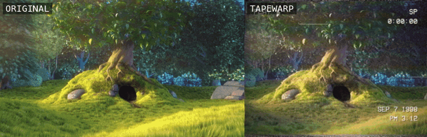

# tapewarp

Make any video look like it was shot on a 1990s camcorder and played back off a
worn VHS tape. One Python file, no ML, no cloud, no watermark. Free forever.



This started as an argument with my son. He uses a paid iPhone app for the VHS
look on his videos and insisted it couldn't be replicated — *"it's not the
static overlay, it's how it moves, and sometimes it warps it."* He's right
about what matters: cheap VHS filters composite a grain texture over the frame
and call it a day. The look is in the **motion**.

So this doesn't overlay anything. Every frame is degraded the way tape
actually degrades:

- **Wave warp + line jitter** — every scanline gets its own horizontal
  displacement, recomputed every frame: slow sine waves rolling through the
  image, per-line noise, extra wobble near the bottom of the frame
- **Tracking errors** — glitch bands that crawl up the frame for a few frames
  at a time: displaced, noisy, desaturated, washed out (the "smack the VCR"
  moment)
- **Head-switching noise** at the bottom edge and a mangled tear band at the
  top, re-randomized every frame
- **Chroma abuse in YIQ space** (NTSC's actual color encoding) — heavy
  horizontal chroma bleed, chroma delayed relative to luma, drifting
  green/magenta color bands
- **Tape ghosting** (previous-frame smear), faint dropout smears (real VCRs
  had dropout compensation, so harsh white slashes are opt-in via
  `--dropouts classic`), streaky luma grain, interlace field flicker, lifted
  blacks, magenta cast, vignette
- **Camcorder OSD** — blocky `PLAY ▶` / `SP` overlay, running tape counter,
  and a burned-in date/time stamp in the bottom-right corner, where 90s
  camcorders actually put it
- **Tape-wow audio** — pitch wobble, lowpass, hiss

Footage with text on screen is the one case where full strength fights you —
title cards and credits get eaten by tracking bands and chroma smear. `--wear
clean --wobble 0.3 --bleed 0.5` keeps the tape look and leaves the words
readable.

## Install

You need [ffmpeg](https://ffmpeg.org) on your PATH, Python 3.9+, and numpy:

```bash
pip install numpy
```

That's the whole dependency list.

## Use

```bash
python tapewarp.py your_video.mov
```

Writes `your_video_vhs.mp4`. More control:

```bash
# how beat-up the tape is
python tapewarp.py clip.mov --wear clean      # fresh tape, one careful owner
python tapewarp.py clip.mov --wear worn       # rented twice a week since 1992 (default)
python tapewarp.py clip.mov --wear trashed    # found in a flooded basement

# period-accurate 4:3 framing (crops like a real camera of the era)
python tapewarp.py clip.mov --ratio 4:3
python tapewarp.py clip.mov --ratio 4:3 --crop-bias 0.3   # slide crop window left of center
python tapewarp.py clip.mov --ratio 4:3-box               # letterbox instead, nothing cropped

# date / time stamp (bottom-right by default, like a real camcorder)
python tapewarp.py clip.mov --date auto --time auto   # parsed from filename or file date
python tapewarp.py clip.mov --date "SEP.7 1998" --time "PM 3:12"
python tapewarp.py clip.mov --date-style numeric      # " 9 7 1998" JVC/Panasonic style
python tapewarp.py clip.mov --stamp-pos bl            # bottom-left (some JVC/Panasonic)
python tapewarp.py clip.mov --date none               # no stamp

# dial the warp back when the frame has text to read
python tapewarp.py clip.mov --wobble 0.3     # gentle drift instead of full wave warp
python tapewarp.py clip.mov --wobble 0       # dead steady (grain and color stay)
python tapewarp.py clip.mov --bleed 0.5      # less chroma smear; colored text stays legible

# extras
python tapewarp.py clip.mov --counter        # running VCR tape counter
python tapewarp.py clip.mov --dropouts classic   # harsh white dropout slashes
python tapewarp.py clip.mov --dropouts off       # no dropout streaks at all
python tapewarp.py clip.mov --no-osd         # image degradation only, no overlay text
python tapewarp.py clip.mov --no-audio-fx    # leave audio untouched
python tapewarp.py clip.mov --seed 7         # different random glitch timing
```

Filenames like `2020-06-26_13-03-13_000.mov` (the default camera-roll pattern)
give `--date auto --time auto` everything they need: `JUN.26 2020` / `PM 1:03`.

## How it works

The video is decoded to ~480 scanlines (VHS luma resolution), and each frame
passes through a numpy pipeline in YIQ color space. The core trick is a
**per-scanline displacement field**: an array of 480 horizontal offsets,
rebuilt every frame from layered sine waves, random jitter, and scheduled
glitch events, then applied to luma and chroma separately (chroma gets extra
jitter — it really did on tape). Everything else — bleed, ghosting, noise,
grade — hangs off that. The result is upscaled back to the source resolution
with a soft bilinear pass, which is itself part of the look.

No frame is ever treated the same way twice. That's the whole point.

## Credits

- Font: [VCR OSD Mono](https://www.dafont.com/vcr-osd-mono.font) by Riciery
  Leal (freeware), bundled as `vcr_osd_mono.ttf`
- Demo footage: [Big Buck Bunny](https://peach.blender.org) © Blender
  Foundation, CC-BY 3.0
- Inspired by an argument with my son, who was right about the paid filters

## License

MIT. Do whatever you want with it.

---

Built by [Lanier](https://lanierdev.com), an applied AI studio. More free
tools at [lanierdev.com/tools](https://lanierdev.com/tools).
